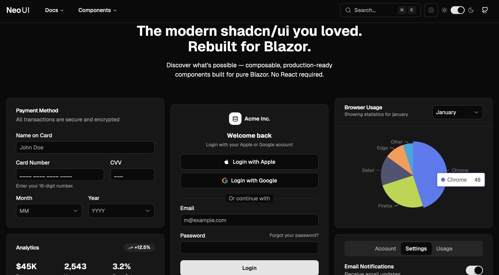

# NeoUI

[](https://neoui.io)
[](https://www.nuget.org/packages/NeoUI.Blazor)
[](LICENSE)

A comprehensive UI component library for Blazor inspired by [shadcn/ui](https://ui.shadcn.com/).

<p align="center">
  <a href="https://neoui.io">
    
  </a>
</p>

<p align="center">
  <a href="https://neoui.io"><strong>Website</strong></a> &nbsp;·&nbsp;
  <a href="https://demos.neoui.io"><strong>Live Demo</strong></a>
</p>

<p align="center">
  <table align="center">
    <tr>
      <td align="center"><b>⚡ Zero Config</b><br/>Pre-built CSS, no Node.js or build tools required</td>
      <td align="center"><b>🧩 135+ Components</b><br/>Modern, composable UI components</td>
      <td align="center"><b>🎨 shadcn/ui Themes</b><br/>Drop in any shadcn/ui or tweakcn theme</td>
      <td align="center"><b>🌙 Dark Mode</b><br/>Built-in light &amp; dark with CSS variables</td>
    </tr>
  </table>
</p>

## 🌟 Overview

NeoUI for Blazor brings the beautiful design system of shadcn/ui to Blazor applications. This library provides **zero-config, plug-and-play UI components** with full shadcn/ui compatibility, featuring pre-built CSS, styled components, and headless primitives that work across all Blazor hosting models (Server, WebAssembly, and Hybrid).

**No Tailwind CSS setup required** - just install the NuGet package and start building!

## ✨ What's New in v4

### 🎨 Theme v2 — The Most Sophisticated Blazor Theming System

v4 brings NeoUI in full parity with shadcn/ui's April 2026 customisation model — and surpasses it with the most comprehensive shadcn-inspired theming system available for Blazor.

#### Style Variant System — 3-Layer CSS Merge Pipeline

Every major component now participates in a **3-layer CSS merge** that faithfully renders shadcn/ui style variants while preserving the Blazor developer experience:

```
Layer 1: Base component classes  (sensible, backward-compatible defaults)
    ↓
Layer 2: StyleVariant overrides  (per-variant Tailwind classes via StyleVariant.GetClasses("Component.Key"))
    ↓
Layer 3: User Class prop          (always wins — merged via tailwind-merge)
```

**50+ components fully wired** — Button, Input, Card, Dialog, Sheet, Drawer, Tabs, Select, Combobox, DropdownMenu, ContextMenu, Menubar, Calendar, Command, Sidebar, TreeView, Toast, Tooltip, RadioGroup, Slider, RangeSlider, Switch, Toggle, ToggleGroup, Progress, Avatar, Badge, Alert, DataGrid, DataView, and more.

#### 7 Named Style Variants

| Variant | Character | `--radius` |
|---|---|---|
| `Default` | Backward-compatible — no visual change | unchanged |
| `Vega` | Professional, balanced | `0.625rem` |
| `Nova` | Compact, dashboard/admin | `0.375rem` |
| `Maia` | Spacious, consumer-friendly | `1rem` |
| `Lyra` | Sharp/boxy, developer tooling | `0rem` |
| `Mira` | Ultra-dense, data-heavy | `0.25rem` |
| `Luma` | Glassmorphism, modern SaaS | `0.75rem` |

`Luma` goes furthest — pill-shaped containers, frosted inputs, stronger overlay blur, per-component shadow tuning — matching shadcn's Luma style exactly.

#### Full Theme Dimension Expansion

| Dimension | Options |
|---|---|
| Style Variant | Default, Vega, Nova, Maia, Lyra, Mira, Luma |
| Base Color | Zinc, Slate, Gray, Neutral, Stone + **Mist, Mauve, Taupe, Olive** (new) |
| Primary Color | 17 colors |
| Radius Preset | None, Small, Medium, Large |
| Font Preset | System, Inter, Geist, CalSans, DmSans, PlusJakarta |
| Menu Color | Default, Inverted, DefaultTranslucent (glassmorphism), InvertedTranslucent |
| Menu Accent | Subtle, Bold |
| Dark Mode | Light / Dark |

#### ThemeSwitcher Redesign

The `ThemeSwitcher` trigger now shows a **two-tone color swatch** reflecting the current base + primary color pair. Add `ShowStyles="true"` to expose the full visual picker with animated tabs:

```razor
@* Minimal — colors + dark mode *@
<ThemeSwitcher />

@* Full picker — all 8 theme dimensions with visual previews *@
<ThemeSwitcher ShowStyles="true" />
```

#### AppProvider — Required Setup

Wrap your layout with `<AppProvider>` to enable StyleVariant propagation and automatic theme initialization:

```razor
@* MainLayout.razor *@
<AppProvider>
    @Body
    @* Portal hosts must be inside AppProvider *@
    <ToastViewport />
    <DialogHost />
</AppProvider>
```

#### Backward Compatible

`StyleVariant.Default` preserves all pre-v4 radius ratios — **existing apps see zero visual change after upgrading**. Theme v2 is entirely opt-in.

## 🚀 Getting Started

### 📦 Installation

Install NeoUI packages from NuGet:

```bash
# Styled components with shadcn/ui design
dotnet add package NeoUI.Blazor

# (Optional) Headless primitives for custom styling
dotnet add package NeoUI.Blazor.Primitives

# Icon libraries (choose one or more)
dotnet add package NeoUI.Icons.Lucide      # 1,640 icons - stroke-based, consistent
dotnet add package NeoUI.Icons.Heroicons   # 1,288 icons - 4 variants (outline, solid, mini, micro)
dotnet add package NeoUI.Icons.Feather     # 286 icons - minimalist, stroke-based
```

### Quick Start

1. **Add to your `_Imports.razor`:**

```razor
@using NeoUI.Blazor
```

   **Optional icon packages** — add whichever you need:

```razor
@using NeoUI.Icons.Lucide      @* 1,640+ icons *@
@using NeoUI.Icons.Heroicons   @* 1,288 icons across 4 variants *@
@using NeoUI.Icons.Feather     @* 286 minimalist icons *@
```

2. **Wrap your layout with `AppProvider`:**

   `AppProvider` initializes `ThemeService` and propagates the active `StyleVariant` to all components. Portal hosts must be placed inside it:

```razor
@inherits LayoutComponentBase

<AppProvider>
    <!-- Your layout content -->
    @Body

    <!-- Portal hosts must be inside AppProvider -->
    <ToastViewport />
    <DialogHost />
</AppProvider>

@* For overlay components to work correctly *@
<ContainerPortalHost />
<OverlayPortalHost />
```

3. **Add CSS and scripts to your `App.razor`:**

   NeoUI Components come with pre-built CSS and a theme script — no Tailwind setup required!

```razor
<!DOCTYPE html>
<html lang="en">
<head>
    <meta charset="utf-8" />
    <meta name="viewport" content="width=device-width, initial-scale=1.0" />
    <base href="/" />
    <!-- Your theme CSS variables -->
    <link rel="stylesheet" href="styles/theme.css" />
    <!-- Pre-built NeoUI styles -->
    <link href="@Assets["_content/NeoUI.Blazor/components.css"]" rel="stylesheet" />
    <!-- Theme script: reads localStorage and applies classes before Blazor loads (prevents FOUC) -->
    <script src="@Assets["_content/NeoUI.Blazor/js/theme.js"]"></script>
    <HeadOutlet @rendermode="InteractiveAuto" />
</head>
<body>
    <Routes @rendermode="InteractiveAuto" />
    <script src="@Assets["_framework/blazor.web.js"]"></script>
</body>
</html>
```

4. **Start using components:**

```razor
<Button Variant="ButtonVariant.Default">Click me</Button>

<Dialog>
    <DialogTrigger AsChild>
        <Button>Open Dialog</Button>
    </DialogTrigger>
    <DialogContent>
        <DialogHeader>
            <DialogTitle>Welcome to NeoUI</DialogTitle>
            <DialogDescription>
                Beautiful Blazor components inspired by shadcn/ui
            </DialogDescription>
        </DialogHeader>
        <DialogFooter>
            <DialogClose AsChild>
                <Button Variant="ButtonVariant.Outline">Close</Button>
            </DialogClose>
        </DialogFooter>
    </DialogContent>
</Dialog>
```

**AsChild Pattern:** Use `AsChild` on trigger components to use your own styled elements (like Button) instead of the default button. This is the industry-standard pattern from Radix UI/shadcn/ui.

### Learn More

- **Contributing**: See [CONTRIBUTING.md](CONTRIBUTING.md) for development setup and guidelines

## Localization

NeoUI ships a built-in `ILocalizer` abstraction — a thin interface that decouples your app from any specific i18n framework.

**Default behaviour** — `DefaultLocalizer` is registered automatically by `AddNeoUIComponents()`. It returns the built-in English strings for every UI key (button labels, ARIA attributes, empty-state messages, etc.). No configuration required.

**Customizing strings** — implement `ILocalizer` and register it *before* calling `AddNeoUIComponents()`:

```csharp
// Option A — custom DefaultLocalizer keys (simplest)
builder.Services.AddSingleton<ILocalizer>(sp =>
    new DefaultLocalizer(keys => {
        keys["Dialog.Close"] = "Schließen";
    }));
builder.Services.AddNeoUIComponents();

// Option B — full IStringLocalizer<T> integration
builder.Services.AddScoped<ILocalizer, StringLocalizerAdapter<MyResources>>();
builder.Services.AddNeoUIComponents();
```

Both options work for Blazor Server, WebAssembly, and Auto mode.

## 🏗️ Architecture

NeoUI uses a **two-layer architecture** with modern .NET 10 features and Auto rendering mode:

### Project Structure

- **NeoUI.Blazor.Primitives** - Headless components (runs on both Server and WebAssembly)
- **NeoUI.Blazor** - Pre-styled components (runs on both Server and WebAssembly)
- **NeoUI.Demo.Shared** - Shared pages, components, services, and static assets (.NET 10)
- **NeoUI.Demo.Server** - Server-only hosting (.NET 10)
- **NeoUI.Demo.Wasm** - WebAssembly-only hosting (.NET 10)
- **NeoUI.Demo.Auto** - Auto mode (Server+WASM) hosting (.NET 10)
- **NeoUI.Demo.Auto.Client** - WASM satellite for Auto mode (.NET 10)

### Rendering Mode

All components support **.NET 10's Auto rendering mode**, which automatically switches between Server and WebAssembly based on availability:

```razor
<!-- App.razor -->
<HeadOutlet @rendermode="InteractiveAuto" />
<Routes @rendermode="InteractiveAuto" />
```

This provides:
- Fast initial load (Server-side rendering)
- Rich interactivity (WebAssembly after download)
- Seamless transition between modes
- Optimal performance for all scenarios

### Styled Components Layer (`NeoUI.Blazor`)
- Pre-styled components matching shadcn/ui design system
- **Pre-built CSS included** - no Tailwind configuration needed
- Built on top of primitives for consistency
- Ready to use out of the box
- Full theme support via CSS variables

### Primitives Layer (`NeoUI.Blazor.Primitives`)
- Headless, unstyled components
- Complete accessibility implementation
- Keyboard navigation and ARIA support
- Maximum flexibility for custom styling

### Key Principles
- **Feature-based organization** - Each component in its own folder with all related files
- **Code-behind pattern** - Clean separation of markup (`.razor`) and logic (`.razor.cs`)
- **CSS Variables theming** - Runtime theme switching with light/dark mode support
- **Accessibility first** - WCAG 2.1 AA compliance with comprehensive keyboard navigation
- **Composition over inheritance** - Components designed to be composed together
- **Progressive enhancement** - Works without JavaScript where possible

## 🎨 Theming

NeoUI is **100% compatible with shadcn/ui themes**, making it easy to customize your application's appearance.

### Using Themes from shadcn/ui and tweakcn

You can use any theme from:
- **[shadcn/ui themes](https://ui.shadcn.com/themes)** - Official shadcn/ui theme gallery
- **[tweakcn.com](https://tweakcn.com)** - Advanced theme customization tool with live preview

Simply copy the CSS variables from these tools and paste them into your `wwwroot/styles/theme.css` file.

### Customizing Your Theme

1. **Create `wwwroot/styles/theme.css`** in your Blazor project

2. **Add your theme variables** inside the `:root` (light mode) and `.dark` (dark mode) selectors:

```css
@layer base {
  :root {
    --background: oklch(1 0 0);
    --foreground: oklch(0.1450 0 0);
    --primary: oklch(0.2050 0 0);
    --primary-foreground: oklch(0.9850 0 0);
    /* ... other variables */
  }

  .dark {
    --background: oklch(0.1450 0 0);
    --foreground: oklch(0.9850 0 0);
    --primary: oklch(0.9220 0 0);
    --primary-foreground: oklch(0.2050 0 0);
    /* ... other variables */
  }
}
```

3. **Reference it in your `App.razor`** before the NeoUI CSS:

```razor
<link rel="stylesheet" href="styles/theme.css" />
<link href="@Assets["_content/NeoUI.Blazor/components.css"]" rel="stylesheet" />
```

That's it! NeoUI will automatically use your theme variables.

### Available Theme Variables

NeoUI supports all standard shadcn/ui CSS variables:
- Colors: `--background`, `--foreground`, `--primary`, `--secondary`, `--accent`, `--destructive`, `--muted`, etc.
- Typography: `--font-sans`, `--font-serif`, `--font-mono`
- Layout: `--radius` (border radius), `--shadow-*` (shadows)
- Charts: `--chart-1` through `--chart-5`
- Sidebar: `--sidebar`, `--sidebar-primary`, `--sidebar-accent`, etc.

### Dark Mode

NeoUI automatically supports dark mode by applying the `.dark` class to the `<html>` element. All components will automatically switch to dark mode colors when this class is present.

### 🎨 Theme v2 — Dynamic Multi-Dimensional Theming

NeoUI includes a **complete runtime theme system** with 8 independently-configurable dimensions:

**ThemeService** — inject anywhere to read or change the theme programmatically:

```csharp
// Apply a built-in preset
await ThemeService.ApplyPresetAsync(ThemePreset.Luma);

// Or set individual dimensions
await ThemeService.SetStyleVariantAsync(StyleVariant.Nova);
await ThemeService.SetBaseColorAsync(BaseColor.Mauve);
await ThemeService.SetMenuColorAsync(MenuColor.DefaultTranslucent);
```

**ThemeSwitcher component** — expose the full visual picker to your users:

```razor
@* Colors + dark mode only (default) *@
<ThemeSwitcher />

@* Full picker with style, radius, font, and menu controls *@
<ThemeSwitcher ShowStyles="true" />
```

> **Setup:** `theme.js` (included automatically) applies saved theme classes before Blazor loads — no FOUC. Wrap your layout in `<AppProvider>` so components receive the active `StyleVariant` cascade. See [THEMING.md](THEMING.md) for the full guide.

## 💅 Styling

### NeoUI.Blazor (Pre-styled)

**No Tailwind CSS setup required!** NeoUI Components include pre-built, production-ready CSS that ships with the NuGet package.

Add the following to your `App.razor`:

```razor
<!DOCTYPE html>
<html lang="en">
<head>
    <meta charset="utf-8" />
    <meta name="viewport" content="width=device-width, initial-scale=1.0" />
    <base href="/" />

    <!-- 1. Your custom theme (defines CSS variables) -->
    <link rel="stylesheet" href="styles/theme.css" />

    <!-- 2. Pre-built NeoUI styles -->
    <link href="@Assets["_content/NeoUI.Blazor/components.css"]" rel="stylesheet" />

    <!-- 3. Theme script: reads localStorage and applies classes before Blazor loads (prevents FOUC) -->
    <script src="@Assets["_content/NeoUI.Blazor/js/theme.js"]"></script>

    <HeadOutlet @rendermode="InteractiveAuto" />
</head>
<body>
    <Routes @rendermode="InteractiveAuto" />
    <script src="@Assets["_framework/blazor.web.js"]"></script>
</body>
</html>
```

**Important:** Load your theme CSS **before** `components.css` so the CSS variables are defined when NeoUI references them.

**Note:** The pre-built CSS is already minified and optimized. You don't need to install Tailwind CSS, configure build processes, or set up any additional tooling.

### NeoUI.Blazor.Primitives (Headless)

Primitives are completely **headless** - they provide behavior and accessibility without any styling. You have complete freedom to style them however you want:

**Option 1: Tailwind CSS** (requires your own Tailwind setup)
```razor
<NeoUI.Blazor.Primitives.Accordion.Accordion class="space-y-4">
    <NeoUI.Blazor.Primitives.Accordion.AccordionItem class="border rounded-lg">
        <!-- Your custom Tailwind classes -->
    </NeoUI.Blazor.Primitives.Accordion.AccordionItem>
</NeoUI.Blazor.Primitives.Accordion.Accordion>
```

**Option 2: CSS Modules / Vanilla CSS**
```razor
<NeoUI.Blazor.Primitives.Accordion.Accordion class="my-accordion">
    <!-- Style with your own CSS -->
</NeoUI.Blazor.Primitives.Accordion.Accordion>
```

**Option 3: Inline Styles**
```razor
<NeoUI.Blazor.Primitives.Accordion.Accordion style="margin: 1rem;">
    <!-- Direct inline styling -->
</NeoUI.Blazor.Primitives.Accordion.Accordion>
```

Primitives give you complete control over styling while handling all the complex behavior, accessibility, and keyboard navigation for you. Unlike `NeoUI.Blazor`, primitives don't include any CSS - you bring your own styling approach.

## 📚 Components

NeoUI includes **135+ styled components** with full shadcn/ui design compatibility:

### Form Components
- **Button** - Multiple variants (default, destructive, outline, secondary, ghost, link) with icon support
- **Button Group** - Visually grouped related buttons with connected styling
- **Checkbox** - Accessible checkbox with indeterminate state
- **Color Picker** - Color selection with hex, RGB, and HSL support
- **Combobox** - Searchable autocomplete dropdown
- **Currency Input** - Formatted currency input with locale support
- **Field** - Combine labels, controls, and help text for accessible forms
- **Input** - Text input with multiple types and validation support
- **Input Group** - Enhanced inputs with icons, buttons, and addons
- **Input OTP** - One-time password input with individual character slots
- **Label** - Accessible form labels
- **Link Button** - Semantic links styled as buttons for navigation
- **Masked Input** - Text input with customizable format masks (phone, date, etc.)
- **Multi Select** - Searchable multi-selection with tags and checkboxes
- **Native Select** - Styled native HTML select dropdown with chevron icon
- **Numeric Input** - Number input with increment/decrement buttons and formatting
- **Radio Group** - Radio button groups with keyboard navigation
- **Range Slider** - Dual-handle slider for selecting value ranges
- **Rating** - Star rating input with half-star precision and readonly mode
- **Select** - Dropdown select with search and keyboard navigation; supports `Presentation="SelectPresentation.BottomSheet"` for a mobile-friendly drawer presentation
- **Slider** - Range input for numeric value selection
- **Switch** - Toggle switch component
- **Textarea** - Multi-line text input with automatic content sizing

### Date & Time
- **Calendar** - Date selection grid with month navigation
- **Date Picker** - Date selection with calendar in popover
- **Date Range Picker** - Date range selection with presets and two-calendar view
- **Time Picker** - Time selection with 12/24-hour format support

### Layout & Navigation
- **Accordion** - Collapsible content sections
- **Aspect Ratio** - Display content within a desired width/height ratio
- **Breadcrumb** - Hierarchical navigation with customizable separators
- **Carousel** - Slideshow component with touch gestures, animations, configurable dot-indicator position (`DotsPosition`: Top, Bottom, Left, Right), and drag-click suppression
- **Card** - Container for grouped content with header and footer
- **Collapsible** - Expandable/collapsible panels
- **Navigation Menu** - Horizontal navigation with dropdown panels
- **Pagination** - Page navigation with Previous/Next/Ellipsis support
- **Resizable** - Split layouts with draggable handles
- **Scroll Area** - Custom scrollbars for styled scroll regions
- **Selection Indicator** - Spring-animated indicator that slides between the active item in any selection container (Tabs, ToggleGroup, DropdownMenuRadioGroup, Pagination, custom markup). Zero wiring — place it as the last child and point it at the active-state attribute. Supports hover preview (`Hover="true"`) and CSS custom properties for animation and underline variants.
- **Sortable** - Drag-and-drop reordering with pointer, touch, and keyboard support. Composes with `DataTable`, `DataView`, and any list component without modifying them — place a `SortableItemHandle` in any column template and it works. Supports **cross-list transfer** between multiple lists sharing a `Group` name, with consumer-controlled transfer events (`OnItemTransferredIn`, `OnItemTransferredOut`, `OnCanDrop`). Use `Context="s"` to get a `SortableScope<TItem>` for passing `data-sortable-id` to any table or grid via `s.RowAttributes`.
- **Item** - Flexible list items with media, content, and actions
- **Separator** - Visual dividers with configurable line style (`Solid`, `Dashed`, `Dotted`)
- **Sidebar** - Responsive sidebar with collapsible icon mode, variants (default, floating, inset), and mobile sheet integration
- **Tabs** - Tabbed interfaces with controlled/uncontrolled modes

### Overlay Components
- **Alert Dialog** - Modal for critical confirmations
- **Context Menu** - Right-click menus with actions and shortcuts
- **Command** - Command palette with keyboard navigation
- **Dialog** - Modal dialogs
- **Dialog Service** - Programmatic dialogs with async/await API for alerts and confirmations
- **Drawer** - Slide-out panel with gesture controls, backdrop, and multi-step **snap points** with draggable handle (bottom direction)
- **Dropdown Menu** - Context menus with nested submenus
- **Hover Card** - Rich hover previews
- **Menubar** - Desktop application-style horizontal menu bar
- **Popover** - Floating content containers
- **Sheet** - Slide-out panels (top, right, bottom, left)
- **Toast** - Temporary notifications with variants and actions
- **Tooltip** - Contextual hover tooltips

### Data & Content
- **DataTable** - Advanced tables with sorting, filtering, pagination, server-side data, column pinning/resizing/reordering, tree/hierarchical rows, row context menu, and virtualization
- **Filter** - Inline canvas filter builder with 8 field types, operator chips, LINQ extensions, and preset support
- **MarkdownEditor** - Rich text editor with toolbar formatting and live preview
- **RichTextEditor** - WYSIWYG editor with formatting toolbar and HTML output

### Display Components
- **Alert** - Status messages and callouts
- **Avatar** - User avatars with fallback support
- **Badge** - Status badges and labels; includes **BadgeIcon** sub-component for icon-based badge chips
- **Card** - Container for grouped content with header and footer
- **Command** - Command palette with keyboard navigation
- **Data Table** - Powerful tables with sorting, filtering, pagination, and selection
- **Empty** - Empty state displays
- **Item** - Flexible list items with media, content, and actions
- **Kbd** - Keyboard shortcut badges
- **Progress** - Progress bars with animations
- **Skeleton** - Loading placeholders
- **Spinner** - Loading indicators
- **Toggle** - Pressable toggle buttons
- **Toggle Group** - Single/multiple selection toggle groups; `Scrollable` for horizontal overflow on mobile, `Required` to prevent deselecting the active item
- **Typography** - Semantic text styling

### Data Visualization
- **Chart** - Beautiful data visualizations with 12 chart types:
  - **Area Chart** - Stacked and gradient area charts
  - **Bar Chart** - Vertical and horizontal bar charts (grouped/stacked)
  - **Candlestick Chart** - OHLC financial candlestick charts
  - **Composed Chart** - Mix multiple chart types (line + bar + area)
  - **Funnel Chart** - Funnel/pipeline visualization
  - **Gauge Chart** - Circular gauge / speedometer charts
  - **Heatmap Chart** - Grid-based intensity heatmaps
  - **Line Chart** - Single and multi-series line charts
  - **Pie Chart** - Pie and donut charts with labels
  - **Radar Chart** - Multi-axis radar/spider charts
  - **Radial Bar Chart** - Circular progress and gauge charts
  - **Scatter Chart** - X/Y coordinate plotting

### Animation
- **Motion** - Declarative animation system powered by Motion.dev with 20+ presets including fade, scale, slide, shake, bounce, pulse, spring physics, scroll-triggered animations, and staggered list/grid animations
- **PageTransition** - Animated page-level transition wrapper; replays an entrance animation on `Key` change (fade, slide variants). Ideal for router-level transitions.
- **ScreenTransition** - Screen-level animated transition wrapper for shell-based navigation. Supports `Tab` (fade), `Push` (slide from right), and `Pop` (slide from left) directions. Pair with `Tabs` for tab-switch fades and a push/pop navigation stack.

### 📱 Mobile

Five dedicated mobile-first components for `.NET MAUI Blazor Hybrid`, PWA, and mobile-first web apps. All live in `NeoUI.Blazor` — no separate package or `@using` required.

- **AppBar** - Mobile-style top application bar with centered title, optional back-chevron (`OnBack`), transparent hero-overlay mode, and a `RightContent` slot
- **BottomNav** + **BottomNavItem** - Persistent bottom tab bar (iOS/Android/MAUI style). Supports 2–5 icon+label items, per-item notification badge, `Fixed` mode toggle for MAUI Hybrid containers, and safe-area inset padding
- **NotificationBadge** - Wraps any element and overlays a count badge (numeric, dot mode, three colour variants, max-count truncation with `N+`)
- **QuantityStepper** - Circular +/− buttons for quantity input. `DestructiveAtMin` swaps the minus button for a trash icon at the minimum value (cart UX)
- **SectionHeader** - Title row with optional "view all" chevron and separator line; eliminates repetitive header boilerplate in content-heavy screens

> **MAUI Hybrid note:** `BottomNav` defaults to `Fixed="true"` (viewport-fixed) but can be set to `Fixed="false"` for in-flow layout inside a `BlazorWebView` container. Safe-area padding is applied via `env(safe-area-inset-bottom)` for iOS home indicator clearance.

### 🎭 Icons

NeoUI offers **three icon library packages** to suit different design preferences:

- **Lucide Icons** (`NeoUI.Icons.Lucide`) - 1,640 beautiful, consistent stroke-based icons
  - ISC licensed
  - 24x24 viewBox, 2px stroke width
  - Perfect for: Modern, clean interfaces

- **Heroicons** (`NeoUI.Icons.Heroicons`) - 1,288 icons across 4 variants
  - MIT licensed by Tailwind Labs
  - Variants: Outline (24x24), Solid (24x24), Mini (20x20), Micro (16x16)
  - Perfect for: Tailwind-based designs, flexible sizing needs

- **Feather Icons** (`NeoUI.Icons.Feather`) - 286 minimalist stroke-based icons
  - MIT licensed
  - 24x24 viewBox, 2px stroke width
  - Perfect for: Simple, lightweight projects

## 🔧 Primitives

NeoUI also includes **16 headless primitive components** for building custom UI:

- Accordion Primitive
- Checkbox Primitive
- Collapsible Primitive
- Dialog Primitive
- Dropdown Menu Primitive
- Hover Card Primitive
- Label Primitive
- Popover Primitive
- Radio Group Primitive
- Select Primitive
- Sheet Primitive
- Sortable Primitive
- Switch Primitive
- Table Primitive
- Tabs Primitive
- Tooltip Primitive

All primitives are fully accessible, keyboard-navigable, and provide complete control over styling.

## ✨ Features

- **Full shadcn/ui Compatibility** - Drop-in Blazor equivalents of shadcn/ui components
- **Zero Configuration** - Pre-built CSS included, no Tailwind setup required
- **🎯 .NET 10 Ready** - Built for the latest .NET platform with Auto rendering mode
- **Auto Rendering Mode** - Seamless transition between Server and WebAssembly rendering
- **🌙 Dark Mode Support** - Built-in light/dark theme switching with CSS variables
- **📱 Mobile-First & MAUI Hybrid Ready** - Dedicated mobile components (AppBar, BottomNav, QuantityStepper, etc.) authored for Blazor mobile-first web apps and .NET MAUI Blazor Hybrid (`BlazorWebView`), with safe-area insets and in-flow layout options
- **♿ Accessibility First** - WCAG 2.1 AA compliant with keyboard navigation and ARIA attributes
- **⌨️ Keyboard Shortcuts** - Native keyboard navigation support (e.g., Ctrl/Cmd+B for sidebar toggle)
- **🔄 State Persistence** - Cookie-based state management for user preferences
- **TypeScript-Inspired API** - Familiar API design for developers coming from React/shadcn/ui
- **Pure Blazor** - No JavaScript dependencies, no Node.js required
- **🎨 Icon Library Options** - 3 separate icon packages (Lucide, Heroicons, Feather) with 3,200+ total icons
- **Form Validation Ready** - Works seamlessly with Blazor's form validation
- **🎨 Style Variant System** - 3-layer CSS merge pipeline with 7 named style variants (Luma, Nova, Maia, Lyra, Mira, Vega, Default); 50+ components fully wired
- **🎭 Luma Glassmorphism** - Comprehensive glassmorphism variant: pill containers, frosted inputs, enhanced overlays — exact Blazor port of shadcn's Luma style

## 📄 License

NeoUI is open source software licensed under the [MIT License](LICENSE).

## 🙏 Acknowledgments

NeoUI is inspired by [shadcn/ui](https://ui.shadcn.com/) and based on the design principles of [Radix UI](https://www.radix-ui.com/).

While NeoUI is a complete reimplementation for Blazor/C# and contains no code from these projects, we are grateful for their excellent work which inspired this library.

- shadcn/ui: MIT License - Copyright (c) 2023 shadcn
- Radix UI: MIT License - Copyright (c) 2022-present WorkOS

NeoUI is an independent project and is not affiliated with or endorsed by shadcn or Radix UI.

**Additional Acknowledgments:**
- Initial Blazor components inspiration by [Mathew Taylor](https://github.com/blazorui-net/ui)
- [Tailwind CSS](https://tailwindcss.com/) - Utility-first CSS framework
- [Lucide Icons](https://lucide.dev/) - Beautiful stroke-based icon library (ISC License)
- [Heroicons](https://heroicons.com/) - Icon library by Tailwind Labs (MIT License)
- [Feather Icons](https://feathericons.com/) - Minimalist icon library (MIT License)
- Built with ❤️ for the Blazor community

## 📊 Version Information

- **Current Version**: 4.0.0
- **Target Framework**: .NET 10
- **Package IDs**: 
  - `NeoUI.Blazor`
  - `NeoUI.Blazor.Primitives`
  - `NeoUI.Icons.Lucide`
  - `NeoUI.Icons.Heroicons`
  - `NeoUI.Icons.Feather`

---

**Note**: These packages were formerly known as `BlazorUI.*`. As of version 1.0.7, the assembly names have been updated to `NeoUI.*` to match the NuGet package IDs, ensuring consistent asset paths when consumed from NuGet.

